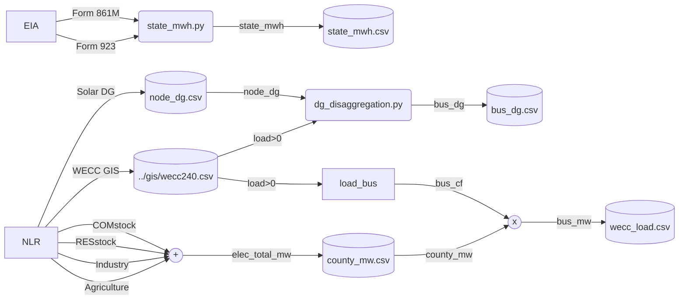

## Load calibration procedure

```mermaid
flowchart LR

    EIA --Form 861M--> state_mwh(state_mwh.py)
    EIA --Form 923--> state_mwh
    state_mwh(state_mwh.py) --state_mwh--> energy[(state_mwh.csv)]

    NLR --Solar DG--> node_dg[(node_dg.csv)] --node_dg--> dg_disaggregation
    NLR --WECC GIS--> wecc240[(../gis/wecc240.csv)] --load>0--> dg_disaggregation
    dg_disaggregation(dg_disaggregation.py) --bus_dg--> bus_dg[(bus_dg.csv)]

    NLR --COMstock--> sum1
    NLR --RESstock--> sum1
    NLR --Industry--> sum1
    NLR --Agriculture--> sum1
    sum1((+)) --elec_total_mw--> county_mw[(county_mw.csv)] --county_mw--> mul1

    wecc240 --load>0--> load_bus --bus_cf--> mul1
    mul1((x)) --bus_mw--> wecc_load[(wecc_load.csv)]
```