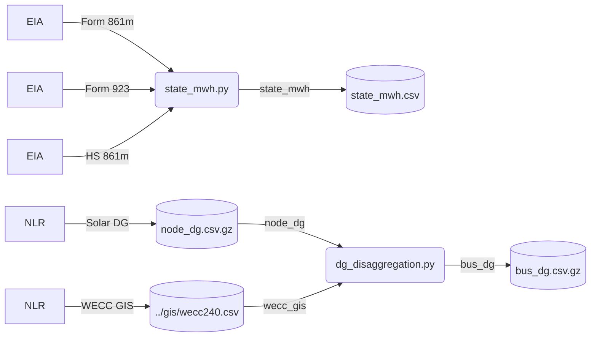

## Load calibration procedure

```mermaid
flowchart LR

    form861m[EIA] --Form 861m--> state_mwh(state_mwh.py)
    form923[EIA] --Form 923--> state_mwh
    hs861m[EIA] --HS 861m--> state_mwh
    state_mwh(state_mwh.py) --state_mwh--> energy[(state_mwh.csv)]

    solar_dg[NLR] --Solar DG--> node_dg[(node_dg.csv.gz)] --node_dg--> dg_disaggregation
    weccgis[NLR] --WECC GIS--> wecc240[(../gis/wecc240.csv)] --wecc_gis--> dg_disaggregation
    dg_disaggregation(dg_disaggregation.py) --bus_dg--> bus_dg[(bus_dg.csv.gz)]
```