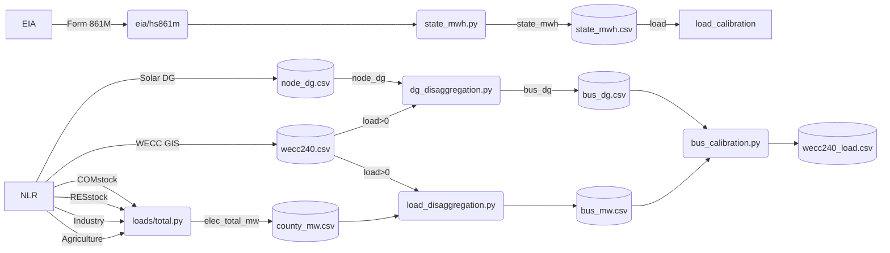

## Load calibration procedure

```mermaid
flowchart LR

    EIA --Form 861M-->  eia/hs862m.py(eia/hs861m) ---> state_mwh
    state_mwh(state_mwh.py) --state_mwh--> energy[(state_mwh.csv)] --load--> load_calibration

    NLR --Solar DG---> node_dg[(node_dg.csv)] --node_dg--> dg_disaggregation
    NLR --WECC GIS---> wecc240[(wecc240.csv)] --load>0--> dg_disaggregation
    dg_disaggregation(dg_disaggregation.py) --bus_dg--> bus_dg[(bus_dg.csv)]

    NLR --COMstock--> loads
    NLR --RESstock--> loads
    NLR --Industry--> loads
    NLR --Agriculture--> loads
    loads(loads/total.py) --elec_total_mw--> county_mw[(county_mw.csv)] --> load_disaggregation
    
    wecc240 --load>0--> load_disaggregation --> bus_mw[(bus_mw.csv)]
    load_disaggregation(load_disaggregation.py)

    bus_dg --> bus_calibration
    bus_mw --> bus_calibration
    bus_calibration(bus_calibration.py) --> wecc240_load
    wecc240_load[(wecc240_load.csv)]
```