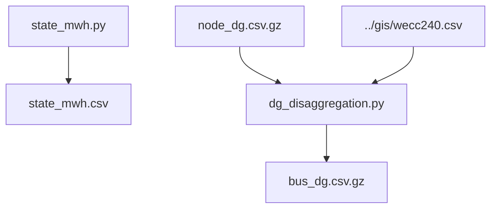

## Load calibration procedure

```mermaid
flowchart TD

    state_mwh.py --> state_mwh.csv

    node_dg.csv.gz --> dg_disaggregation.py
    ../gis/wecc240.csv --> dg_disaggregation.py
    dg_disaggregation.py --> bus_dg.csv.gz
```