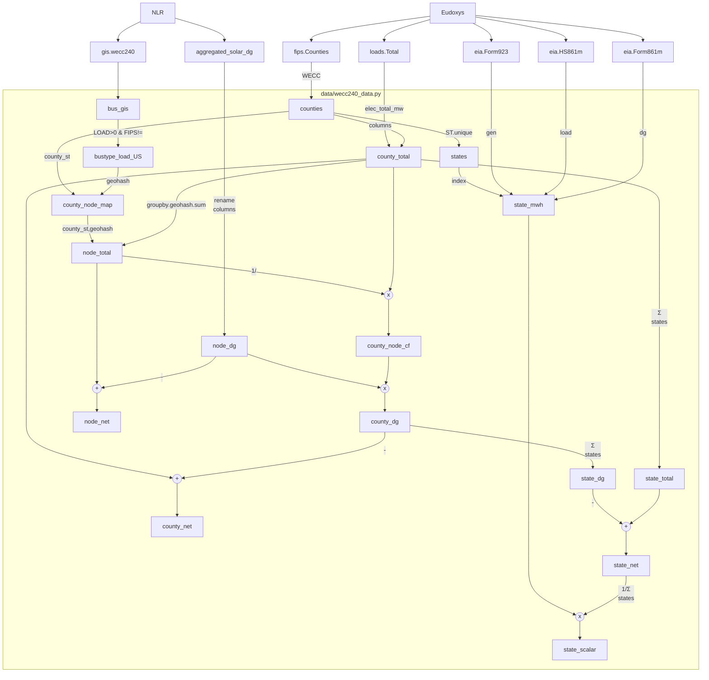

## WECC 240 model data flow

```mermaid
flowchart TD
    
    Eudoxys --> fips.Counties
    fips.Counties -->|WECC| counties 
    
    states -->|index| state_mwh
    Eudoxys --> eia.Form923 ---->|gen| state_mwh
    Eudoxys --> eia.HS861m ---->|load| state_mwh
    Eudoxys --> eia.Form861m ---->|dg| state_mwh
    
    NLR --> solar_dg["aggregated_solar_dg"] ------->|rename
    columns| node_dg
    
    
    NLR --> gis.wecc240
    gis.wecc240 --> bus_gis
    bus_gis -->|LOAD>0 & FIPS!=""| bustype_load_US

    Eudoxys --> loads.Total
    loads.Total --->|elec_total_mw| county_total

    counties -->|county_st| county_node_map
    counties -->|ST.unique| states
    counties -->|columns| county_total
    bustype_load_US -->|geohash| county_node_map

    county_node_map -->|county_st,geohash| node_total 
    county_total --->|groupby.geohash.sum| node_total

    node_total -->|1/| mul1
    mul1 --> county_node_cf
    county_total --> mul1

    node_dg --> mul2
    county_node_cf --> mul2
    mul2 --> county_dg

    node_total --> sum1
    node_dg -->|-| sum1
    sum1 --> node_net

    county_total --> sum2
    county_dg -->|-| sum2
    sum2 --> county_net

    county_total -->|Σ
    states| state_total
    county_dg -->|Σ
        states| state_dg
    
    state_dg -->|-| sum3
    state_total --> sum3
    sum3 --> state_net

    state_mwh --> mul3
    state_net -->|1/Σ
        states| mul3
    mul3 --> state_scalar

    subgraph data/wecc240_data.py
        counties
        states
        bus_gis
        bustype_load_US

        node_dg
        node_total
        node_net

        county_node_cf
        county_node_map
        county_dg
        county_total
        county_net

        state_mwh
        state_total
        state_dg
        state_net
        state_scalar

        sum1((+))
        sum2((+))
        sum3((+))

        mul1((x))
        mul2((x))
        mul3((x))
    end
```