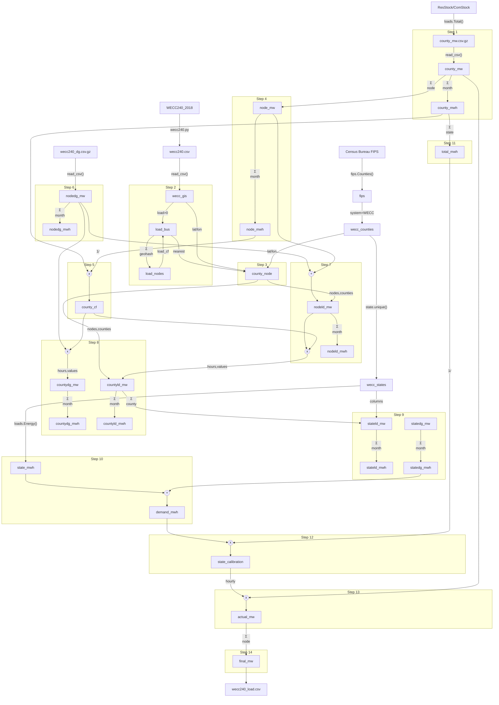

```mermaid
flowchart TD

    %% Inputs
    ResStock/ComStock --loads.Total()--> county_mw.csv.gz

    census["Census Bureau FIPS"] --fips.Counties()--> fips
    fips --system=WECC--> wecc_counties
    wecc_counties --state.unique()--> wecc_states
    wecc_counties --lat/lon--> county_node
    wecc_states --columns--> stateld_mw

    WECC240_2018 --wecc240.py--> wecc240.csv

    wecc240.csv --read_csv()--> wecc_gis
    wecc240_dg.csv.gz --read_csv()--> nodedg_mw

    wecc_states --loads.Energy()--> state_mwh

    %% Step 1
    subgraph Step 1
        county_mw.csv.gz --read_csv()--> county_mw
        county_mw --Σ
            month--> county_mwh
    end

    %% Step 2
    subgraph Step 2
        wecc_gis --load>0--> load_bus
        load_bus --Σ
            geohash--> load_nodes
        load_nodes --load_cf--> load_bus
    end

    %% Step 3
    subgraph Step 3
        load_bus --nearest--> county_node
        wecc_gis --lat/lon--> county_node
    end

    %% Step 4
    subgraph Step 4
        county_mw --Σ
            node--> node_mw
        node_mw --Σ
            month----> node_mwh
    end

    %% Step 5
    subgraph Step 5
        county_mwh --> node5
        node_mwh --1/--> node5
        node5((x)) --> county_cf
    end

    %% Step 6
    subgraph Step 6
        nodedg_mw --Σ
            month--> nodedg_mwh
    end

    %% Step 7
    subgraph Step 7
        nodeld_mw --> node8ld
        nodedg_mw ---> node7
        node_mw ---> node7
        node7((+)) --> nodeld_mw
        nodeld_mw --Σ
            month--> nodeld_mwh
    end

    %% Step 8
    subgraph Step 8
        county_node -->|nodes,counties| nodeld_mw
        nodedg_mw --> node8dg
        county_cf --> node8dg
        node8dg((x)) -->|hours,values| countydg_mw
        countydg_mw --Σ
            month--> countydg_mwh

        county_node -->|nodes,counties| countyld_mw
        county_cf --> node8ld
        node8ld((x)) -->|hours,values| countyld_mw
        countyld_mw --Σ
            month--> countyld_mwh
        
    end

    %% Step 9
    subgraph Step 9
        countyld_mw --Σ
            county--> stateld_mw
        stateld_mw --Σ
            month--> stateld_mwh
        statedg_mw --Σ
            month--> statedg_mwh
    end

    %% Step 10
    subgraph Step 10
        state_mwh --> node10
        statedg_mwh --> node10
        node10((+)) --> demand_mwh
    end

    %% Step 11
    subgraph Step 11
        county_mwh --Σ
            state--> total_mwh
    end

    %% Step 12
    subgraph Step 12
        demand_mwh --> node12
        total_mwh -->|1/| node12
        node12((x)) --> state_calibration
    end

    %% Step 13
    subgraph Step 13
        state_calibration -->|hourly| node13
        county_mw --> node13
        node13((x)) --> actual_mw 
    end

    %% Step 14
    subgraph Step 14
        actual_mw --Σ
            node--> final_mw
    end

    final_mw --> wecc240_load.csv
```