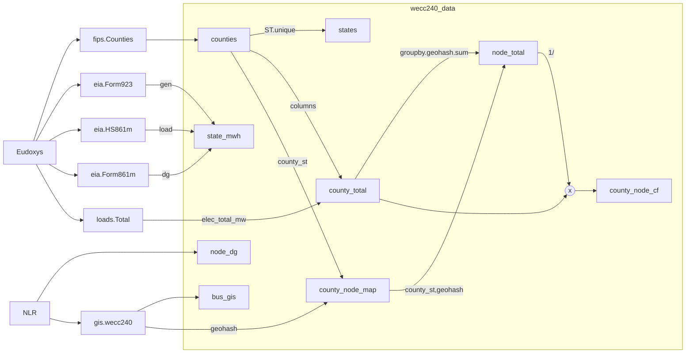

## Load calibration procedure

```mermaid
flowchart LR
    
    Eudoxys --> fips.Counties
    fips.Counties --> counties 
    
    Eudoxys --> eia.Form923 -->|gen| state_mwh
    Eudoxys --> eia.HS861m -->|load| state_mwh
    Eudoxys --> eia.Form861m -->|dg| state_mwh
    
    NLR --> node_dg
    
    counties -->|ST.unique| states
    
    NLR --> gis.wecc240
    gis.wecc240 --> bus_gis

    counties -->|columns| county_total
    Eudoxys --> loads.Total
    loads.Total --->|elec_total_mw| county_total

    counties -->|county_st| county_node_map
    gis.wecc240 --->|geohash| county_node_map

    county_node_map -->|county_st,geohash| node_total 
    county_total -->|groupby.geohash.sum| node_total

    node_total -->|1/| mul1
    mul1((x)) --> county_node_cf
    county_total --> mul1

    subgraph wecc240_data
        counties
        states
        bus_gis
        node_dg
        state_mwh
        county_total
        county_node_map
        node_total
        county_node_cf

        mul1
    end
```